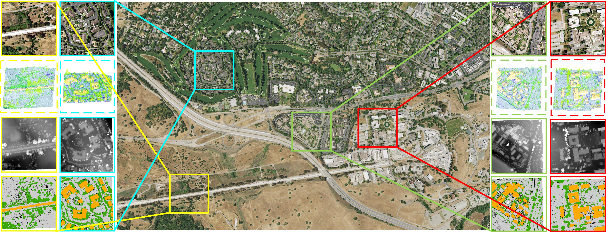

# Imbalance Knowledge-Driven Multi-modal Network for Land-Cover Semantic Segmentation Using Aerial Images and LiDAR Point Clouds
Yameng Wang, Yi Wan, Yongjun Zhang, Bin Zhang, Zhi Gao
___________

This is the official PyTorch implementation of  [IKD-Net](https://arxiv.org/ftp/arxiv/papers/2303/2303.15777.pdf). The workflow is as follows:


Requirements
---------------------
 * CUDA 11.1 (Ubuntu 20.04)
 * PyTorch 1.8.2
 * Open3D  0.15.2
 * GDAL 3.4.0
 * laspy 2.1.2

N3C-California Dataset
---------------------
N3C-California is a specialized benchmark dataset for quantitative evaluation in multi-modal joint segmentation tasks, which is the largest coverage area annotated LiDAR-imagery dataset to date.



Google drive: 

Baiduyun: 

How to use it?
---------------------
Set the environment variable `OPEN3D_ML_ROOT` to the root dir of the repo. 
```bash
source /path/to/IKDNet-pytorch/set_open3d_ml_root.sh
```

Training the netwrok.
```bash
CUDA_VISIBLE_DEVICES=0 python3 scripts/run_pipeline.py torch -c ml3d/configs/siamesenet_multisantaclara.yml --dataset.dataset_path path/to/your/dataset/ --dataset.cache_dir path/to/your/cache/ --pipeline SemanticSegmentationDual --dataset.use_cache True
```

Testing.
```bash
CUDA_VISIBLE_DEVICES=0 python3 scripts/run_pipeline.py torch -c ml3d/configs/siamesenet_multisantaclara.yml --dataset.dataset_path path/to/your/dataset/ --dataset.cache_dir path/to/your/cache/ --pipeline SemanticSegmentationDual --dataset.use_cache True --split test --ckpt_path path/to/weight/file/
```


Citation
---------------------

**Please kindly cite the papers if this code is useful and helpful for your research.**

Yameng Wang, Yi Wan, Yongjun Zhang, Bin Zhang, Zhi Gao. Imbalance Knowledge-Driven Multi-modal Network for Land-Cover Semantic Segmentation Using Aerial Images and LiDAR Point Clouds[J]. arXiv preprint arXiv:2303.15777, 2023.
